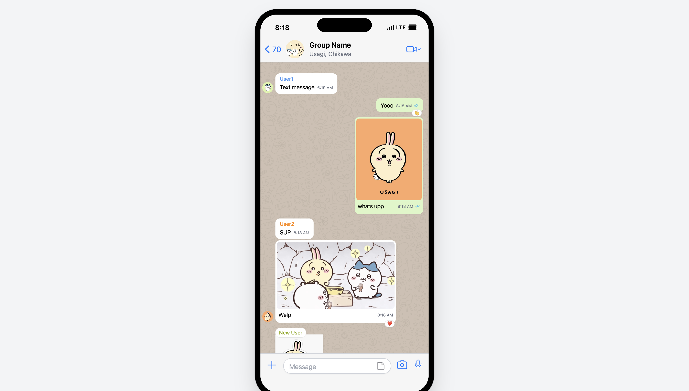
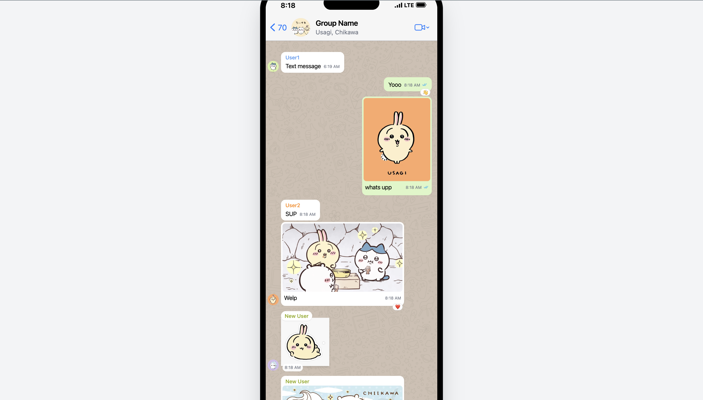
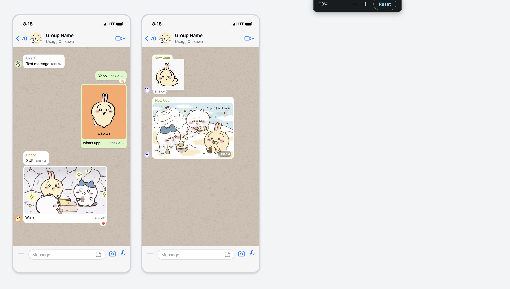

# 💬 Local WhatsApp Mockup Editor (iOS Edition)

**👉 [Try it live in your browser here!](https://shl0402.github.io/fake-whatsapp-UI-chat-IOS-/) 👈**

A completely local, zero-install, single-file web application for generating pixel-perfect, highly authentic iOS WhatsApp chat mockups. 

Built with React and Tailwind CSS, this tool runs entirely in your browser without any backend server. Everything stays on your local machine, ensuring complete privacy.

## 📸 Editor Preview

## ✨ Key Features

* **Zero Setup:** It’s just one `index.html` file. No installations, no build steps, no servers. Just open it and start creating.
* **Pixel-Perfect iOS UI:** Features the iOS status bar, Dynamic Island/Notch, precise Apple system fonts, native WhatsApp color palettes, read-receipt ticks, and the authentic chat background.
* **Dark & Light Themes:** Instantly toggle between authentic iOS light mode and OLED-optimized dark mode (complete with the subtle doodle background blend).
* **Smart Message Grouping:** Automatically hides consecutive avatars, names, and bubble tails just like the real app.
* **Drag & Drop Reordering:** Grab any message by its handle to quickly drag and drop it anywhere in the timeline (auto-scrolls when dragging near the edges).
* **Compact / Expand View:** Toggle the editor list into a compact row view to easily manage and reorder massive chat histories without endlessly scrolling.
* **Global Chat Scale:** Use a slider to fluidly scale the UI up or down (from 0.5x to 1.5x) to perfectly frame your content without breaking the layout.
* **Rich Media Support:** * Upload standard photos (with smart margins and overlay timestamps).
  * Upload transparent stickers (automatically pairs double-stickers side-by-side).
* **Emoji Reactions:** Add floating reaction bubbles to any text, photo, or sticker.
* **@Mentions:** Automatically parses text and turns `@Usernames` into the native iOS blue link color.
* **Deterministic Colors:** Automatically assigns persistent, authentic WhatsApp group colors to different user names based on their text.

## 💾 Saving & Sharing

Because this app has no backend, it uses **Base64 Encoding** to save your work locally. 

* **Export JSON:** Saves your current chat configuration, messages, and uploaded photos (encoded directly into text) as a `.json` file.
* **Import JSON:** Upload a previously saved `.json` file to instantly pick up exactly where you left off.
* **Unsafe Changes Safeguard:** Warns you if you try to close the tab or refresh without exporting your latest changes.

### 📤 Export HTML Formats
When you are ready to share your mockup, click **Export HTML** to choose from three standalone, read-only `.html` files. All images and settings are permanently "baked" into the file so they can be easily shared or hosted anywhere!

**1. Interactive Scroll**
A fixed-size iPhone frame centered on the screen. Users can physically scroll *inside* the phone to read the chat. Perfect for hosting on a free site and sharing via QR code.

**2. Full Length Capture**
Unlocks the scroll height and stretches the iPhone frame downward to fit the entire chat. Perfect for using a Chrome Extension to take one massive, high-res full-page screenshot.

**3. Paginated Storyboard**
Automatically measures your chat and breaks it into uniform, side-by-side screens. Includes a built-in **Preflight Overlay** so you can preview your page breaks before downloading. Perfect for presentation slides or print layout.

## 🚀 How to Use

1. **Use the Live Link:** Just click the link at the top of this page to use the app instantly! 
2. **Or Run Locally:** Since the app is entirely self-contained, you can simply copy the raw code from `index.html`, paste it into a blank text file on your computer, save it as `index.html`, and double-click it to open in any web browser (the other files in this repository are just examples!).
3. **Customize:** Use the left panel to configure the chat header, time, battery/network status, and add messages.
4. **Reorder:** Toggle "Collapse All" to easily drag-and-drop messages into your preferred order.
5. **Preview:** Watch the right panel update live.
6. **Export:** Use the Export buttons at the top to save your JSON data or generate shareable HTML files!

## 🛠 Tech Stack
* HTML5
* React 18 (via CDN)
* Tailwind CSS (via CDN)
* Babel (Standalone, via CDN)

## ⚠️ Disclaimer
This project is for educational, editorial, and design mockup purposes only. It is not affiliated with, maintained, authorized, endorsed, or sponsored by WhatsApp or Meta.
