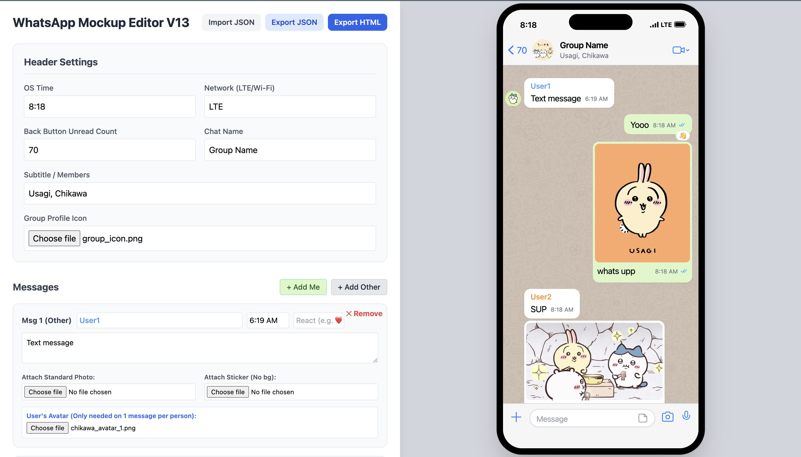
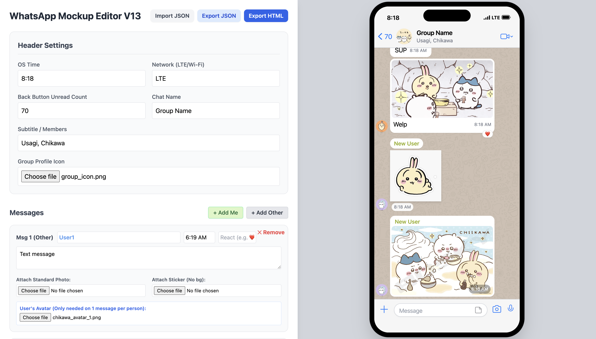

# 💬 Local WhatsApp Mockup Editor (iOS Edition)

A completely local, zero-install, single-file web application for generating pixel-perfect, highly authentic iOS WhatsApp chat mockups. 

Built with React and Tailwind CSS, this tool runs entirely in your browser without any backend server. Everything stays on your local machine, ensuring complete privacy.

## 📸 Previews

## ✨ Key Features

* **Zero Setup:** It’s just one `index.html` file. No `npm install`, no build steps, no servers. Just double-click and open it in Chrome/Safari.
* **Pixel-Perfect iOS UI:** Features the iOS status bar, Dynamic Island/Notch, precise Apple system fonts, native WhatsApp color palettes, read-receipt ticks, and the authentic chat background.
* **Smart Message Grouping:** Automatically hides consecutive avatars, names, and bubble tails just like the real app.
* **Rich Media Support:** * Upload standard photos (with smart margins and overlay timestamps).
  * Upload transparent stickers (automatically pairs double-stickers side-by-side).
* **Emoji Reactions:** Add floating reaction bubbles to any text, photo, or sticker.
* **@Mentions:** Automatically parses text and turns `@Usernames` into the native iOS blue link color.
* **Deterministic Colors:** Automatically assigns persistent, authentic WhatsApp group colors to different user names based on their text.

## 💾 Saving & Sharing

Because this app has no backend, it uses **Base64 Encoding** to save your work. 

* **Export JSON:** Saves your current chat configuration, messages, and uploaded photos (encoded directly into text) as a `.json` file.
* **Import JSON:** Upload a previously saved `.json` file to instantly pick up exactly where you left off.
* **Export HTML:** Generates two standalone, read-only `.html` files for sharing:
  1. `whatsapp-interactive.html`: A fixed-size iPhone frame where you scroll *inside* the screen. Perfect for hosting on a free site (like Netlify) and sharing via QR code.
  2. `whatsapp-full-capture.html`: Unlocks the scroll height and stretches the iPhone frame to fit the entire chat. Perfect for using a Chrome Extension to take one massive, high-res full-page screenshot.

## 🚀 How to Use

1. Download or clone the repository.
2. Double-click `index.html` to open it in your web browser.
3. Use the left panel to configure the chat header, time, battery/network status, and add messages.
4. Watch the right panel update live.
5. Use the Export buttons at the top to save your work or generate shareable files!

## 🛠 Tech Stack
* HTML5
* React 18 (via CDN)
* Tailwind CSS (via CDN)
* Babel (Standalone, via CDN)

## ⚠️ Disclaimer
This project is for educational, editorial, and design mockup purposes only. It is not affiliated with, maintained, authorized, endorsed, or sponsored by WhatsApp or Meta.